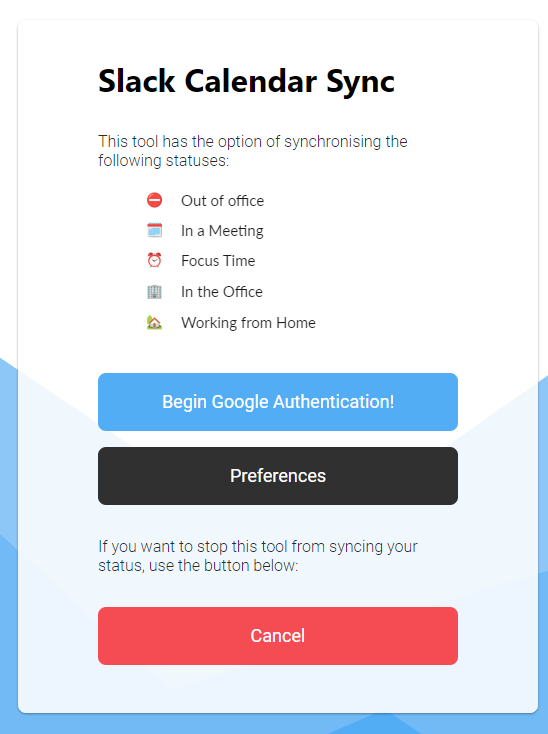

# Slack Calendar Sync

Reads a user's Google Calendar to locate the most relevant current activity and updates their Slack profile with a matching status.

## Getting Started

### Prerequisites

* VS Code - Code editor or equivelant
* NodeJS

### Installing

Clone the repo and call `npm i` in the project folder to get all the node dependencies.

### Development

Run `npm run build` and then `npm run start` to have the environment running.
The interface should be available at [localhost](https://localhost:3000).

### Building

The application is developed in TypeScript, run `npm run build` to generate the JavaScript source in the `dist` folder.

### Running

Ensure valid SSL credentials are present and then `npm run start` to run the application.

### Testing

No tests are implemented for this project.

## Contributing

Development practice follows [GitHub flow](https://guides.github.com/introduction/flow/).

### Coding Style

| Language | Standard |
| -- | -- |
| Javascript | [AirBnB](https://github.com/airbnb/javascript) |

## Versioning

This project is using [SemVer](http://semver.org/) for versioning. For the versions available, see the [tags on this repositiory](https://github.com/your/project/tags).

## Authors

* **Kallum Burgin** - *Software Engineer*

See also the list of [contributors](https://github.com/Kallb123/Slack-Calendar-Sync/graphs/contributors) who participated in this project.

## Acknowledgments

*This markdown sheet is quite handy! [Link](https://github.com/adam-p/markdown-here/wiki/Markdown-Cheatsheet)*
